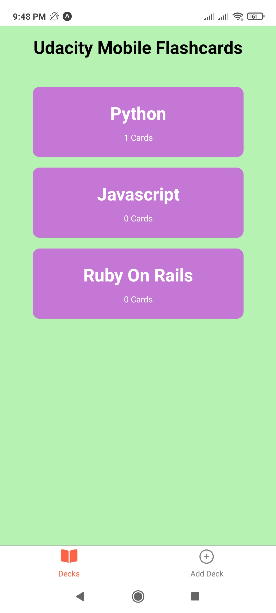
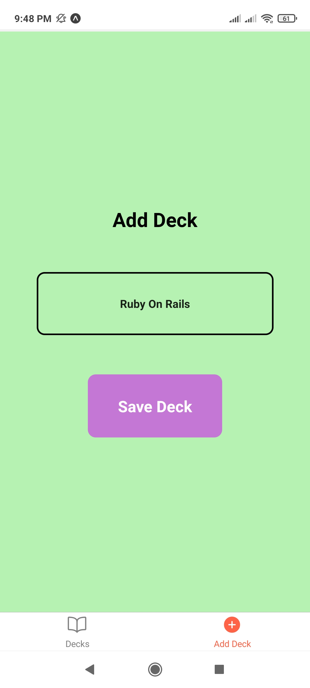
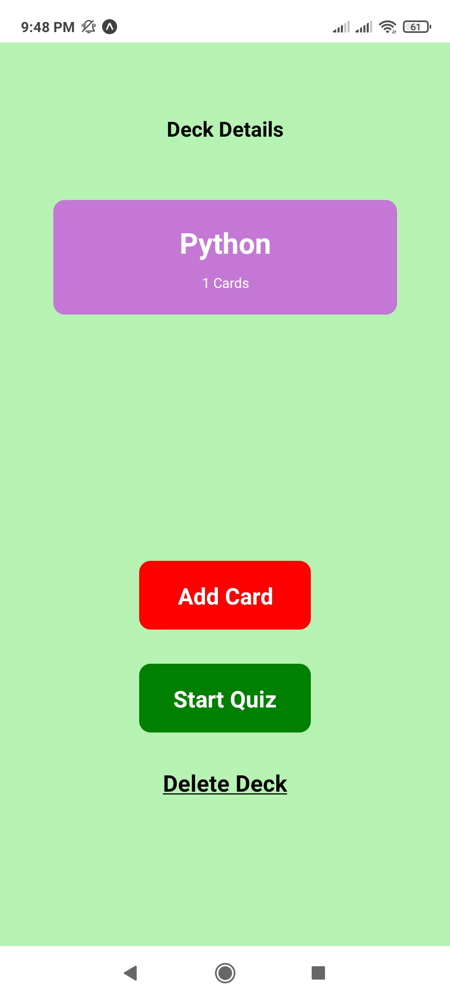
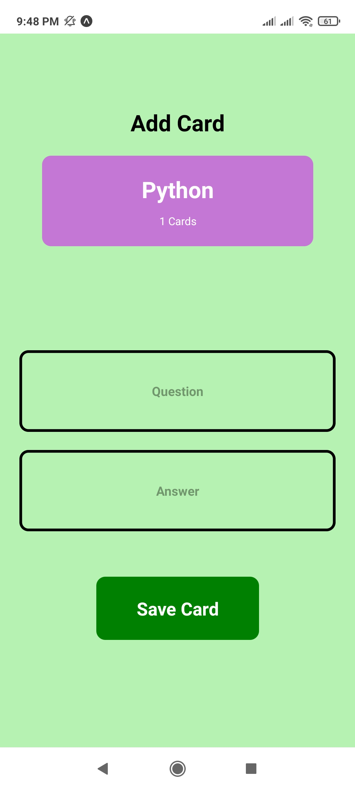
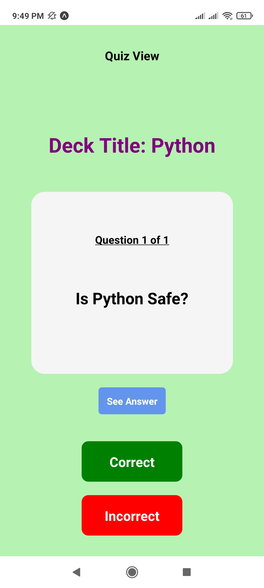
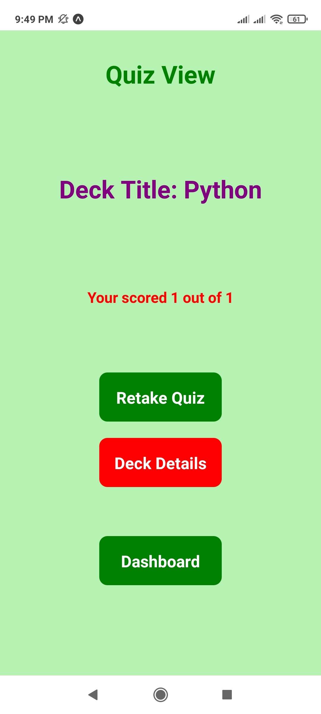
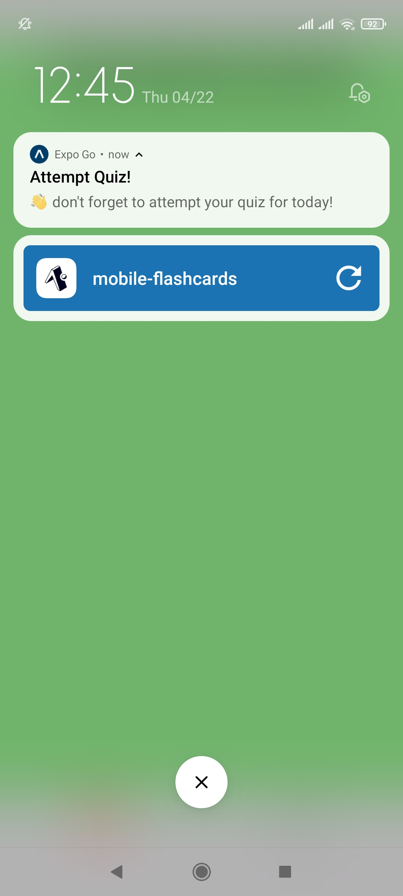

# Udacity Mobile Flashcards

**This is my submission for** `Mobile Flashcards`

( Tested Using Expo App on **Android - Redmi Note 9S** )

## **Project Overview**

For the `Mobile Flashchards` project, I built a mobile application (Android) that allows users to study collections of flashcards.

The app will allow users to create different categories of flashcards called "decks", add flashcards to those decks, then take quizzes on those decks.

To get started using this app right away:

* Install all project dependencies with `yarn install`
* Start the app with `yarn android` or `yarn web` if you want to test using Expo Application by scanning QR

## Application Screenshots

* **_Main Dashboard View_**

* **_Add Deck View_**

* **_Deck Details View_**

* **_Add Card View_**

* **_Quiz View_**

* **_Quiz Result View_**

* **_Scheduled Notification_**

